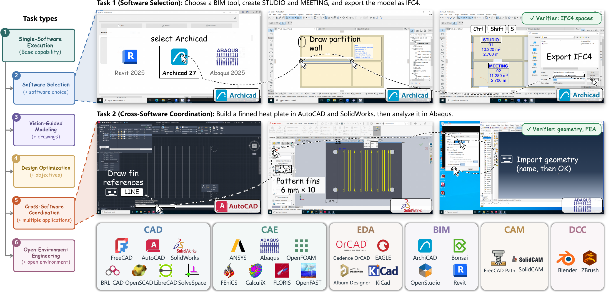

[English](README.md) | [简体中文](README_CN.md)

<h1 align="center">EngiWorld</h1>
<p align="center"><strong>What Can Frontier Agents Deliver in Professional Engineering Environments?</strong></p>

<p align="center">
  <a href="https://engiworld.github.io/">🌐 项目网站</a> ·
  <a href="https://arxiv.org/abs/2609.37686">📄 论文</a> ·
  <a href="task/">🧩 任务与评分器</a> ·
  <a href="https://huggingface.co/datasets/HongchengGao/EngiWorld-Tasks">🤗 任务数据集</a> ·
  <a href="https://huggingface.co/datasets/HongchengGao/EngiWorld-Images">🤗 环境镜像</a>
</p>

<p align="center"><a href="LICENSE"></a></p>

<p align="center"><a href="assets/engiworld-overview.png"></a></p>

<p align="center"><em>覆盖六类工程软件任务，按交付成果进行评测。点击查看大图。</em></p>

EngiWorld 评测智能体能否操作专业工程软件，并交付符合要求的工程成果。本仓库提供完整的 **1,301 个任务**、自动评分器和运行框架，支持 GUI 与 CLI 交互。论文主实验使用其中 306 个任务，清单见 [`task/splits/main-306.txt`](task/splits/main-306.txt)。

完整的 1,301 个任务及其验证器也已发布至 [Hugging Face 任务数据集](https://huggingface.co/datasets/HongchengGao/EngiWorld-Tasks)，可通过[数据集预览器](https://huggingface.co/datasets/HongchengGao/EngiWorld-Tasks/viewer/default/tasks)在线浏览任务说明和元数据。

基准覆盖 CAD、CAE、CAM、BIM、EDA 和 DCC 六个领域。六类任务为单软件执行（931）、软件选择（140）、视觉引导建模（120）、设计优化（40）、跨软件协同（60）和开放环境工程（10）。

单机评测在 Linux 主机上通过 Docker 启动 Windows 或 Ubuntu 虚拟机，调用模型并保存评分结果。

## 💾 安装

准备一台 x86_64 Linux 服务器，安装 Python 3.10、[Docker Engine](https://docs.docker.com/engine/install/) 和 `zstd`。有 `/dev/kvm` 时，虚拟机使用硬件加速；没有时，Docker 运行器会尝试软件模拟，启动和运行会更慢。每个环境默认使用 4 个 CPU、16 GB 内存。

获取代码并进入运行目录：

```bash
git clone --branch main --single-branch --depth 1 https://github.com/Hongcheng-Gao/Engiworld.git &&
cd Engiworld/runtime
```

使用 Python 自带的 `venv` 安装运行依赖：

```bash
python3.10 -m venv .venv
source .venv/bin/activate
python -m pip install -e ".[worker-api]" huggingface_hub
```

下面的命令都在 `runtime/` 目录中执行。

## 🚀 快速开始

下面以 LibreCAD 任务为例，依次准备软件环境、启动任务，再运行模型和评分。

### 1. 下载环境镜像

任务在装有工程软件的虚拟机中运行。本例从 [Hugging Face 环境镜像仓库](https://huggingface.co/datasets/HongchengGao/EngiWorld-Images)下载 LibreCAD 镜像并解压：

```bash
hf download HongchengGao/EngiWorld-Images \
  --repo-type dataset --local-dir ../environment-images \
  images/LibreCAD2.2.0.2.qcow2.zst &&
zstd -d ../environment-images/images/LibreCAD2.2.0.2.qcow2.zst
```

镜像解压到 `../environment-images/images/LibreCAD2.2.0.2.qcow2`。

### 2. 启动任务

准备所选任务的输入和评分资源：

```bash
python -m engiworld.prepare_tasks --task single-software-execution/gui/librecad/task-08
```

```bash
python -m engiworld.local_eval \
  --task single-software-execution/gui/librecad/task-08 \
  --image ../environment-images/images/LibreCAD2.2.0.2.qcow2 \
  --smoke-test
```

这条命令启动虚拟机、加载任务输入，并在结果目录保存一张 `smoke.png` 截图；整个过程不调用模型。

**没有 KVM 的服务器：** 可以用下面的命令查看当前服务器是否提供 `/dev/kvm`：

```bash
test -e /dev/kvm && echo "KVM available" || echo "Software emulation"
```

如果显示 `Software emulation`，仍运行上面的 `--smoke-test` 命令，程序会自动选择软件模拟，无需修改参数。启动可能需要数分钟；终端显示 `"status": "environment_ready"`，且结果目录中出现 `smoke.png` 后，打开截图确认 LibreCAD 和输入图纸已就绪。接着按第 3 步运行模型并评分。

### 3. 运行模型并评分

配置兼容 OpenAI Chat Completions 的模型接口，然后运行任务：

```bash
export OPENAI_BASE_URL="https://your-api-endpoint/v1"
export OPENAI_API_KEY="your-api-key"

python -m engiworld.local_eval \
  --task single-software-execution/gui/librecad/task-08 \
  --image ../environment-images/images/LibreCAD2.2.0.2.qcow2 \
  --model your-model-name \
  --result-dir results
```

运行完成后，终端会显示结果文件的位置。`summary.json` 汇总本次运行，`result.txt` 保存任务得分，`traj.jsonl` 记录模型操作。其他任务可使用任务目录路径或 JSON ID 作为 `--task`，通过 `engiworld.prepare_tasks --task` 准备资源，并按任务文件中的 `snapshot` 准备对应镜像。执行 `python -m engiworld.prepare_tasks` 可下载全部 1,301 条任务的资源。更多参数见[运行框架说明](runtime/README_CN.md)。

## 仓库结构

```text
task/<类别>/<gui|cli>/<软件或软件1--软件2>/<任务编号>/
runtime/
```

任务分为 `single-software-execution`、`cross-software-coordination`、`software-selection`、
`design-optimization`、`vision-guided-modeling` 和 `open-environment-engineering`。
开放环境工程任务使用 **CLI**，位于 `task/open-environment-engineering/cli/agent-selected/`，
由智能体在空白环境中自行选择和安装软件。

任务 JSON 的 ID 格式为 `<类别>--<gui|cli>--<软件>--<任务编号>--<系统>`，例如
`single-software-execution--gui--librecad--task-08--ubuntu`。`--task` 同时支持此 ID 和任务目录路径。
详见[任务说明](task/README_CN.md)。

目录类别和 JSON ID 已按 2026-10-09 新版论文统一命名。`task/aliases.json` 保留历史 JSON ID 和目录名的对应关系；本运行框架可继续使用旧标识选择任务。完整改名表见 [`id-migration-20261009.json`](task/id-migration-20261009.json)，任务名称与数量见 [`taxonomy.json`](task/taxonomy.json)。

## 📊 模型评测结果

论文主实验在同一组 **306 个任务**上评测七个模型：**158 个 CLI**、**148 个 GUI**，包含全部 10 个开放环境工程任务。EngiScore 为任务得分的平均值，满分 100。执行指标在全部 306 个任务（含未成功运行）上取平均，输出 Token 按每轮统计，单位为千。

| 模型 | EngiScore | CLI | GUI | 轮/任务 | 输出 Token（K/轮） | 费用（美元/任务） |
| --- | ---: | ---: | ---: | ---: | ---: | ---: |
| Claude Opus 5 | **44.7** | 48.6 | 40.5 | 69.5 | 2.4 | 18.78 |
| GPT-5.6 Sol | 38.6 | 47.9 | 28.6 | 54.2 | 1.0 | 9.57 |
| Qwen3.8 Max | 26.3 | 35.3 | 16.6 | 107.3 | 2.7 | 6.44 |
| Gemini 3.7 Flash | 26.1 | 37.2 | 14.2 | 110.0 | 0.7 | 2.08 |
| DeepSeek V4.1 Flash | 25.9 | 48.3 | 2.0 | 115.3 | 9.8 | 0.80 |
| Kimi K3 | 24.3 | 31.3 | 16.7 | 92.1 | 0.9 | 5.85 |
| Qwen3.8 Flash | 16.7 | 31.5 | 1.0 | 119.6 | 1.3 | 0.44 |

## 📚 引用

如果在研究中使用 EngiWorld，请引用：

```bibtex
@misc{engiworld2026,
  title = {EngiWorld: What Can Frontier Agents Deliver in Professional Engineering Environments?},
  author = {Hongcheng Gao and Hailong Qu and Yu Lei and Henghui Sun and Haoyang Li and Yipeng Wei and Naihao Xue and Xiaohan Yu and Zhuo Tao and Yihe Zang and Yajiao Wang and Jingyi Tang and Yi Li and Jingjing Zhou and Jie Luo and Bohan Zeng and Chengyu Shen and Hao Jiang and Chong Chen and Bowen Qu and Olive Huang and Zeqiang Wang},
  year = {2026},
  eprint = {2609.37686},
  archivePrefix = {arXiv},
  primaryClass = {cs.AI},
  url = {https://arxiv.org/abs/2609.37686}
}
```

## 📄 许可

EngiWorld 原创代码采用 [MIT License](LICENSE)。第三方组件许可见[第三方说明](THIRD_PARTY_NOTICES.md)。
