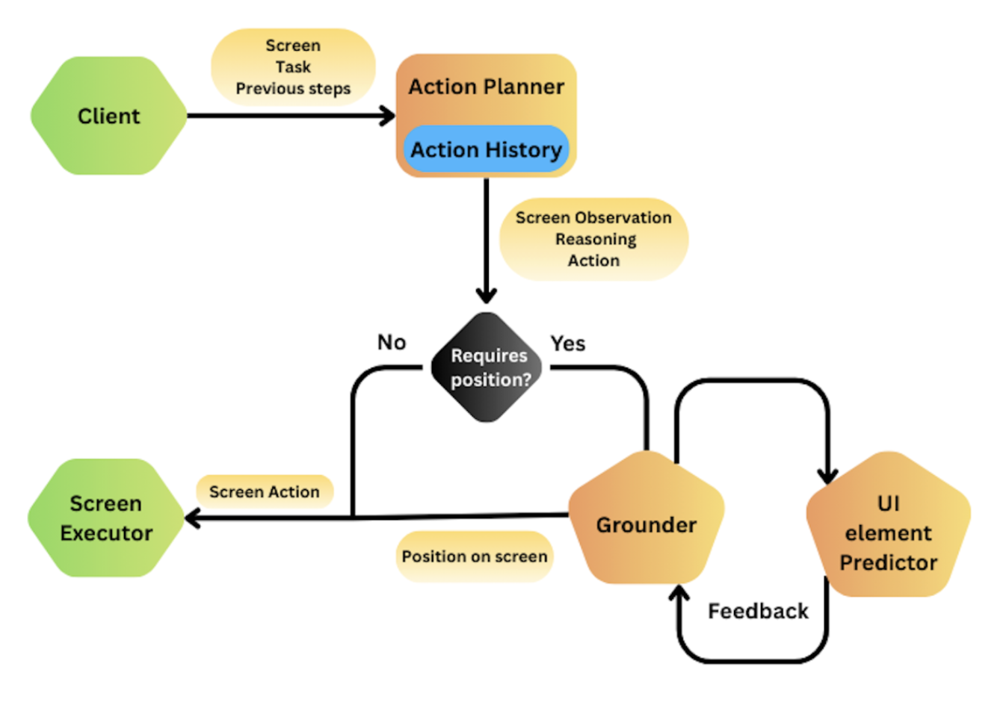
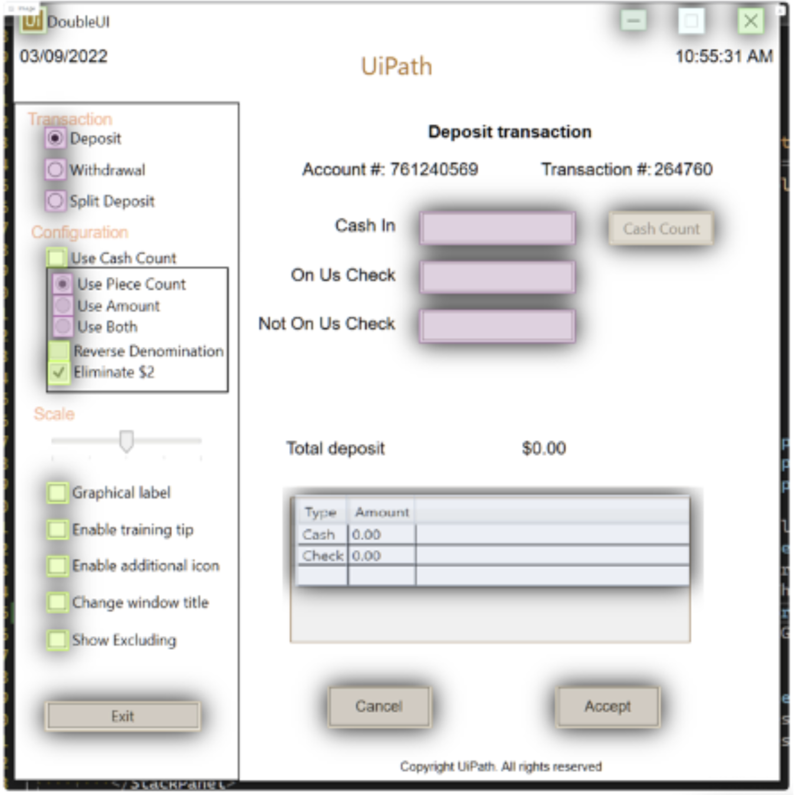

[English](README.md) | [简体中文](README_CN.md)

# UiPath Screen Agent

### 2025 年 12 月 23 日

- 规划模型更新为 [Claude 4.5 Opus](https://www.anthropic.com/news/claude-opus-4-5)。
- 定位模型更新为内部微调的 [Qwen3-VL](https://github.com/QwenLM/Qwen3-VL)，允许对不存在的元素返回 refusal。
- 增加跨步信息记忆。
- 改善 UI 元素检测器对单元格角点等细节的利用。
- 完成重构与若干修复。

### 2025 年 9 月 18 日

原始实现使用较轻量的配置和纯 UI 动作，在 50 步 OSWorld 评测中报告了 **53.6%** 的成绩。

系统采用高层推理与低层执行分开的两阶段架构：

- 动作规划器（GPT-5）：生成高层动作序列、推理任务目标并观察环境变化。
- 定位器（UI-TARS 1.5 + 内部 UI 预测器）：将计划映射为屏幕交互位置，内部预测器辅助处理模糊定位，使预测更可能落在 UI 元素内。



## 运行

```
python run_multienv_uipath.py \
  --provider_name docker \
  --observation_type screenshot \
  --model uipath_gpt_5 \
  --sleep_after_execution 3 \
  --max_steps 50 \
  --num_envs 10 \
  --action_space computer_13 \
  --client_password password \
  --test_all_meta_path evaluation_examples/test_all.json \
  --uipath_model_name gpt-5-2025-08-07
```

## 动作规划器

规划器接收当前截图、任务描述和历史步骤，包括截图、观察、推理与预测动作。它规划完成任务的下一步，预期环境变化，并给出动作及依据。

历史以对话形式组织：用户消息包含任务、已执行动作、最多最近两张截图及此前预测的结果；助手消息保存先前响应。这与模型训练时的对话格式一致。

结合当前状态和历史，规划器可以回溯动作序列、识别失败并规划后续步骤。

支持的 UI 动作包括：

- 点击（左键、右键、双击、三击等）
- 输入
- 滚动
- 拖拽
- 移动鼠标
- 按键
- 提取数据：为后续步骤保存信息的伪动作
- 完成

通过少样本示例说明动作使用方式。为单独评测 UI 操作能力，没有引入无法跨应用通用的复杂动作。

## 定位器

对于点击、滚动、拖拽等动作，定位器接收截图、动作描述和动作类型，返回屏幕坐标整数对。

原实现使用 `UI-TARS-1.5`，结合内部 UI 元素预测器进行裁剪与细化。

### 裁剪与细化

内部 UI 元素预测器用于增加定位与元素对齐的概率，并让模型有机会修改初始结果，不保证预测一定落在检测框内。

该预测器使用共享特征骨干和多个预测分支，识别：

- 图标、输入框、复选框、按钮、单选按钮等 UI 元素。
- 表格与单元格。
- 其他未用于本方法、但在训练和其他场景中辅助特征提取的任务。



多数界面动作直接作用于按钮、输入框、图标或菜单。预测落在所有元素之外时，可能定位有误；关闭弹窗、拖选文本或切换焦点等操作也可能合理地发生在元素外，因此只能视为重新检查的信号。

当首次预测落在已识别元素之外时，在其附近裁剪截图，包含邻近 UI 元素，再次运行定位。这样为模型提供修正机会，但不保证第二次结果正确。

原实验中约 11% 的初始预测位于 UI 元素之外。细化后的第二次预测均与首次不同，说明模型会根据该反馈调整结果。

## 小结

该流程控制规划 token 开销，不采用并行规划，也不依赖大量历史图片，仅使用直接 UI 动作并细化定位。原始报告在 50 步 OSWorld 评测中取得 **53.6%** 的成绩。
