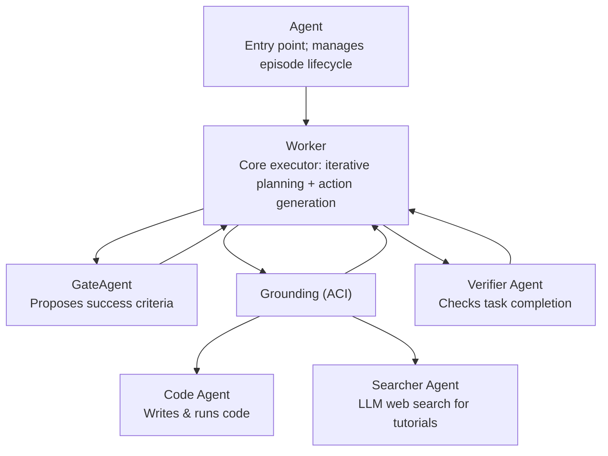

[English](README.md) | [简体中文](README_CN.md)

# VLAA-GUI

VLAA-GUI 是桌面 GUI 自动化多智能体系统，通过专门的子智能体将复杂任务分解为感知、规划和执行。

## 架构



### 子智能体

| 智能体 | 职责 |
|---|---|
| Worker | 接收任务和截图，维护迭代计划，每步选择下一个动作。 |
| Grounding（ACI） | 使用视觉定位模型（如 Qwen GUI Plus）将自然语言目标映射为屏幕坐标，支持 Tesseract OCR 回退。 |
| GateAgent | 在第一步提出 1–3 个可通过 UI 观察的成功条件，供 Worker 每步检查。 |
| VerifierAgent | 在 Worker 宣布完成时独立检查是否完成，必要时要求重新规划。 |
| CodeAgent | 为文件操作、终端命令等适合编码的动作生成并执行多步 pyautogui 脚本。 |
| SearcherAgent | 遇到不熟悉的软件或流程时，搜索教程和提示。 |

## 快速开始

### 1. 配置环境

按 [OSWorld 安装指南](https://github.com/xlang-ai/OSWorld) 安装此独立适配器所需环境。

在 AWS 上运行这组原始评测时，基础镜像使用 `ami-0b505e9d0d99ba88c`，详见[原后端代码](https://github.com/xlang-ai/OSWorld/blob/main/desktop_env/providers/aws/manager.py)。

### 2. 安装额外依赖

```bash
pip install pytesseract scikit-learn backoff boto3 google-genai
```

### 3. 配置 API 密钥

根据使用的服务商设置环境变量：

```bash
# Main reasoning model (Anthropic Bedrock — uses default AWS credential chain)
export AWS_REGION=us-east-1

# Visual grounding (Qwen)
export DASHSCOPE_API_KEY=your_key

# Web search (Gemini)
export GEMINI_API_KEY=your_key

...
```

### 4. 运行评测

```bash
bash scripts/bash/run_vlaa_gui.sh
```

脚本支持通过环境变量覆盖设置：

```bash
PROVIDER_NAME=aws \
REGION=us-east-1 \
NUM_ENVS=4 \
MAX_STEPS=100 \
RESULT_DIR=./results \
TEST_META_PATH=evaluation_examples/test_all.json \
  bash scripts/bash/run_vlaa_gui.sh
```

### 主要参数

| 参数 | 含义 |
|---|---|
| `--with_reflection` | Worker 在规划下一步前反思动作结果 |
| `--use_verifier` | 启用 VerifierAgent 确认任务完成 |
| `--enable_gate` | 启用 GateAgent 提出成功条件 |
| `--loop_detection` | 识别并打断重复动作循环 |
| `--feasibility_check` | 跳过智能体判定不可行的任务 |
| `--action_space pyautogui_coding` | 使用 CodeAgent 执行多步 pyautogui 脚本 |

## 项目来源

该实现基于 [Agent-S](https://github.com/simular-ai/Agent-S)，增加了 gate、verifier、code、search 子智能体、多服务商模型支持及 Bedrock 提示词缓存。
